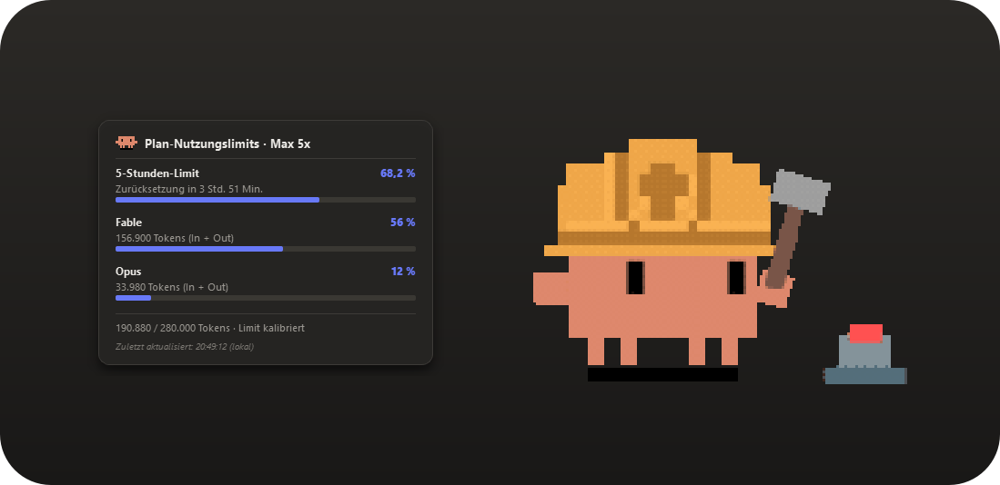
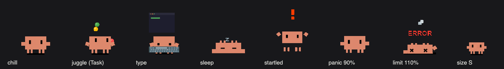

# Clawd — Claude Code Desktop-Pet

[English](README.md) · **Deutsch**

Ein kleines, immer sichtbares Desktop-Pet, das deinen Claude-Code-Verbrauch
live überwacht. Solange Budget da ist, chillt er — wird es knapp, gerät er
in Panik.



## Schnellstart (Windows — kein Python nötig)

1. **[ClawdPet.exe](https://github.com/malzinger/clawd-pet/releases/latest/download/ClawdPet.exe)** herunterladen (Direktlink)
2. Doppelklicken. Fertig — Clawd erscheint auf deinem Desktop.

> Hinweis: Der grüne „Code → Download ZIP"-Button enthält nur den Quellcode —
> die exe liegt unter [Releases](https://github.com/malzinger/clawd-pet/releases).

> Die exe ist unsigniert, Windows SmartScreen warnt eventuell beim ersten
> Start: „Weitere Informationen" → „Trotzdem ausführen".

## Aus dem Quellcode starten (Windows / macOS / Linux)

```bash
git clone https://github.com/malzinger/clawd-pet.git
cd clawd-pet
pip install -r requirements.txt
python clawd_pet.py
```

Unter Windows `py` statt `python`, falls Python nicht im PATH liegt — oder
einfach Doppelklick auf `start_clawd.bat` (startet ohne Konsolenfenster).

Die eigenständige exe selbst bauen:

```bash
pip install pyinstaller
python -m PyInstaller --onefile --windowed --name ClawdPet --icon "docs/clawd.ico" --add-data "sprites;sprites" --add-data "sounds;sounds" --add-data "clawd_hook.py;." --add-data "clawd_permission_hook.py;." clawd_pet.py
```

## Code-Aufbau

`clawd_pet.py` ist nur der Einstiegspunkt; die Implementierung liegt im
Paket `clawdpet/` — grob: `usage` (Log-Scan, 5-h-Fenster, Kalibrierung),
`api` (Read-only-Live-Sync), `activity`/`hooks` (Echtzeit), `art`/`pet`/
`panel`/`bubble` (Qt-Oberfläche), `app` (Controller + Tray) und `selftest`
(Headless-Smoke-Test, läuft auch in der CI).

## Clawds Stimmungen

| Auslastung      | Stimmung   | Was du siehst                       |
| --------------- | ---------- | ----------------------------------- |
| keine Aktivität | Schläft    | eingerollt, schnarcht               |
| 0 – 50 %        | Chillt     | entspanntes Herumstehen             |
| 50 – 80 %       | Werkelt    | hämmert fleißig mit Bauhelm         |
| 80 – 100 %      | Panik      | hektisches Debugging                |
| ≥ 100 %         | Limit      | auf dem Rücken, X-Augen, ERROR      |



## Was es macht

- Scannt alle 2 Sekunden deine lokalen Claude-Code-Logs
  (`~/.claude/projects/**/*.jsonl`) auf einem Hintergrund-Thread,
  rekonstruiert aus den Zeitstempeln Anthropics **festes 5-Stunden-Fenster**
  (startet mit deiner ersten Nachricht und setzt sich nach 5 h komplett
  zurück — wie in Claudes eigener Anzeige) und summiert nur die Tokens des
  aktuellen Fensters (Streaming-Duplikate werden dedupliziert). Nichts
  verlässt deinen Rechner — kein Account, keine Cloud.
- Klick oder Hover auf Clawd öffnet ein Panel im Claude-Look: 5-Stunden-Limit
  mit Fortschrittsbalken, **Aufschlüsselung pro Modell** (Fable, Opus,
  Sonnet, …) und Countdown bis zum Fenster-Reset.
- **Sieh, woran Claude arbeitet:** Ganz oben im Panel stehen das aktuelle
  Projekt, dein letzter Prompt und das laufende Tool mit konkretem Ziel
  („bearbeitet clawd_pet.py", „führt aus: git push") — direkt aus dem lokalen
  Session-Log gelesen, nichts wird gesendet. Clawd selbst animiert passend
  dazu — tippt beim Bearbeiten, liest beim Suchen, denkt zwischen Tools und
  zeigt eine Benachrichtigung, wenn Claude auf dich wartet. Wenn er nichts zu
  tun hat, spielt er ab und zu eine zufällige Animation (jonglieren, fegen,
  dirigieren …), und wenn du ihn zu oft streichelst, wird er genervt.
- **Live-Sync (exakte Zahlen):** Clawd zeigt exakt die Auslastung aus Claudes
  eigenem `/usage`-Popup — alle paar Sekunden aktualisiert. Für *dauerhafte*
  Live-Werte richtest du den **Clawd-Login** ein (Tray-Menü): Ein einmaliger
  Browser-Login gibt Clawd einen eigenen, separaten OAuth-Grant (wie ein
  drittes Gerät) in `~/.clawd/auth.json`, den Clawd selbst auto-refresht —
  Claude Codes Credential-Store wird nie angefasst. Ohne eigenen Login liest
  Clawd ersatzweise Claude Codes gespeichertes Token READ-ONLY, solange es
  gültig ist, und fällt danach auf die Schätzung zurück — kalibriert aus der
  letzten Live-Messung, sodass sie nah dran bleibt.
- **Selbst-kalibrierend (Fallback):** Ist der Live-Sync nicht verfügbar,
  Rechtsklick → „Limit kalibrieren …" und den Prozentwert aus Claudes
  eigenem `/usage`-Popup eintippen — die App leitet daraus dein echtes Budget ab.
- **Burn-Rate-Prognose:** Das Panel rechnet hoch, wann du bei aktuellem
  Tempo das Limit erreichst („Bei diesem Tempo: Limit ca. 16:40 Uhr") —
  oder bestätigt, dass das Tempo bis zum Reset reicht.
- **Benachrichtigungen:** Tray-Toasts beim Überschreiten von 80 % / 95 %, beim
  Reset des 5-Stunden-Fensters („Budget wieder frisch!") und — der nützliche
  Fall — **wenn Claude einen Turn beendet oder auf deine Eingabe wartet**,
  während du woanders hinschaust. Ein Turn-Timer („· 2:14") in der Aufgaben-
  Ansicht zeigt, wie lange der aktuelle Turn schon läuft. Benachrichtigungen
  (und optional ein Ton) im Tray-Menü umschaltbar.
- **Nutzungsverlauf:** Das Panel zeichnet eine 24-Stunden-Sparkline aus einer
  lokalen Verlaufsdatei (`~/.clawd/history.json`) — so siehst du, wann du am
  meisten verbrauchst. Nichts verlässt deinen Rechner.
- **Update-Prüfung:** Beim Start (und alle 6 Std.) fragt Clawd bei GitHub
  nach, ob eine neuere Version existiert, und zeigt bei Bedarf eine Sprechblase
  zum Herunterladen. Im Tray-Menü abschaltbar.
- **Beim Anmelden starten:** Ein Häkchen im Tray-Menü registriert oder
  entfernt den Autostart (Windows-Run-Key bzw. macOS-LaunchAgent).
- **Reagiert in Echtzeit:** Ein leichtgewichtiger Watcher verfolgt das neueste
  Session-Log — Clawd hämmert, während Claude Tools ausführt, freut sich, wenn
  der Turn fertig ist, und Sprechblasen verraten, was gerade passiert („führt
  Befehle aus …"). Abschaltbar über das Tray-Menü.
- **Optionale Hooks (Beta):** Tray-Menü → „Echtzeit-Hooks aktivieren"
  registriert Claude-Code-Hooks für Sofort-Reaktionen — inklusive „Claude
  wartet auf deine Eingabe". Benötigt Python im PATH; von `settings.json`
  wird ein `.clawd-bak`-Backup angelegt, Deaktivieren geht im selben Menü.
  Die Events sind mit einem lokalen Token (`~/.clawd/hook_token`)
  authentifiziert, damit kein anderer Prozess auf dem Rechner sie fälschen
  kann.
- **Permission-Bubble (Beta, opt-in):** Fragt Claude Code nach einer
  Berechtigung, erscheint eine kleine Erlauben/Ablehnen-Karte am Pet — ein
  Klick beantwortet den Prompt, ohne ins Terminal zu wechseln. Fail-open:
  Reagierst du nicht (oder läuft das Pet nicht), übernimmt nach einem kurzen
  Moment der normale Terminal-Prompt. Nutzt den dedizierten
  `PermissionRequest`-Hook und denselben authentifizierten lokalen Kanal.
- **Nicht stören:** Ein Tray-Schalter stellt Sprechblasen, Toasts und Sounds
  auf einmal stumm (Permission-Fragen bleiben dann im Terminal). Und ein
  Klick auf eine „Claude braucht dich"-Bubble holt dein Terminal nach vorn
  (macOS; Warp, iTerm2, Terminal, VS Code, Cursor).
- **Streicheln:** Doppelklick auf Clawd lässt Herzchen aufsteigen. Pack ihn
  und schleudere ihn — er fliegt im Bogen, prallt an den Bildschirmkanten ab
  und landet wieder auf den Füßen. Schleicht sich der Mauszeiger an den
  schlafenden Clawd heran, schreckt er kurz hoch. Delegiert Claude an
  Subagenten (Task/Agent-Tools), jongliert Clawd.
- **Herumlaufen (opt-in):** Ein Tray-Schalter lässt Clawd im Leerlauf über
  den Bildschirm spazieren — an den Kanten dreht er um, bei Hover, Drag oder
  sobald Claude arbeitet, bleibt er stehen.
- **Auch Codex CLI:** Wer zusätzlich OpenAIs Codex CLI nutzt, sieht Clawd
  auch auf dessen Sessions reagieren (`~/.codex/sessions`) — Claude-Sessions
  haben immer Vorrang.
- **Kosten-Schätzung & Projekt-Split:** Das Panel zeigt den ungefähren
  API-Gegenwert des aktuellen Fensters/der Woche und welche Projekte die
  meisten Tokens verbrauchen (Top 3).
- **Mach ihn zu deinem:** Tray-Menü mit drei Größen (S/M/L), optionalen
  Benachrichtigungs-Sounds (mit System-Beep-Fallback), Klick-Durchlässigkeit
  und eigenen Sprite-Packs — einfach einen Ordner mit kompatiblen GIFs wählen.
- **Zweisprachig:** Die komplette Oberfläche (Panel, Sprechblasen, Menüs,
  Dialoge, Zahlenformate) schaltet zwischen Deutsch und Englisch um —
  Tray-Menü → „Language/Sprache".
- Frei per Drag verschiebbar, Position wird gemerkt. Tray-Icon mit manuellem
  Refresh, Verstecken und Beenden.
- Es läuft immer nur eine Instanz — startest du die exe erneut, sagt sie dir
  nur, dass Clawd schon auf deinem Desktop sitzt.

## Plattform-Hinweise

- Windows / macOS: Transparenz funktioniert out of the box.
- Linux: benötigt einen Compositing-Fenstermanager (Standard bei KDE/GNOME).
- Headless-Smoke-Test: `python clawd_pet.py --selftest`

## Credits & Lizenz

MIT — siehe [LICENSE](LICENSE). Die Pixel-Art-Animationen stammen aus dem
MIT-lizenzierten Community-Projekt
[KebeliSamet0/clawd](https://github.com/KebeliSamet0/clawd); fehlt der
`sprites/`-Ordner, zeichnet die App einen eingebauten Vektor-Clawd.
Inoffizielles Fan-Projekt, nicht mit Anthropic verbunden.
